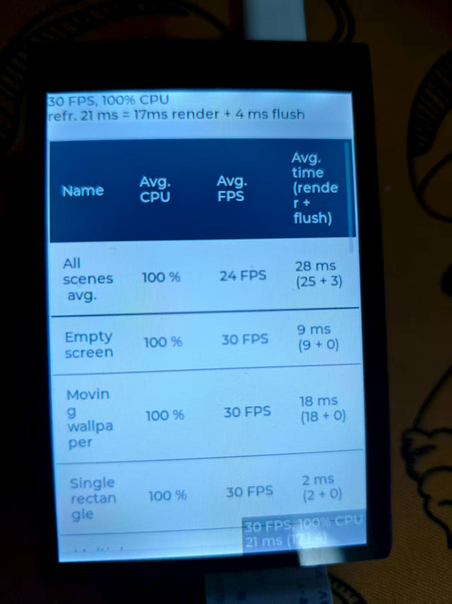

# ART-PI 嵌入式应用项目

基于 STM32H750 芯片的 ART-PI 开发板嵌入式应用程序，集成了 FreeRTOS 实时操作系统、LVGL 图形界面库、WiFi 连接功能和多种外设驱动。

## 项目特性

- **硬件平台**: STM32H750VB（Cortex-M7 内核）
- **实时操作系统**: FreeRTOS
- **图形界面**: LVGL v9.2.2
- **显示器**: 320×480 RGB565 彩色屏幕
- **连接功能**: WiFi（AP6212 模块）
- **存储**: QSPI Flash + SD 卡 + 外部 SRAM
- **开发工具**: CMake 构建系统，支持 GCC 和 Clang 编译器
- **调试接口**: SWD
- **命令行界面**: FreeRTOS CLI

## 系统架构

### 内存布局


- **Internal RAM**:
  - DTCM: 128KB（快速数据访问）
  - AXI SRAM: 512KB（主内存）
  - SRAM1-4: 288KB（外设和 DMA 缓冲区）
- **External SRAM**: 32MB（LVGL 帧缓冲区专用）
- **Flash**: 内部 128KB + 外部 QSPI Flash 16MB

### LVGL 配置说明

**显示驱动配置**：

1. **LV_ST_LTDC_USE_DMA2D_FLUSH** 选项：
   - 无论是否启用 OS，可以使用 DMA2D 并行地刷新部分缓冲区，与其他 LVGL 任务一起
   - 如果显示不是部分显示，则无需启用此选项
   - **注意**: 不能与 `LV_USE_DRAW_DMA2D` 同时启用

2. **LV_USE_DRAW_DMA2D**：
   - 适用于配备了 NeoChrom GPU 的 STM32 MCU
   - 提供硬件加速的图形渲染功能

**UI 设计工具**：

- **SquareLine Studio v1.5.3**：用于可视化 UI 设计
- **项目名称**：POS（支付终端演示）
- **支持组件**：按钮、文本框、键盘、列表、图片等

## 功能模块

### 1. WiFi 连接功能

支持 WiFi 网络扫描和连接，集成 AP6212 WiFi 模块：

**硬件信息**：

- **MAC 地址**: 动态分配（例：70:4A:0E:52:E9:2E）
- **固件版本**: wl0 7.45.98.117
- **WHD 版本**: v3.3.0

**功能特性**：

- 自动扫描附近 WiFi 网络
- 显示网络强度（RSSI）、信道和安全类型
- 支持 WPA2_AES_PSK 和 WPA2_MIXED_PSK 安全协议

### 2. 图形用户界面

基于 LVGL v9.2.2 构建的现代化 UI 界面：

**显示规格**：

- **分辨率**: 320×480 像素
- **颜色深度**: RGB565（16 位色彩）
- **性能**: 支持动画、透明度、平滑滚动

**UI 组件**：

- 多级菜单导航
- 数字键盘输入
- 支付方式选择（Bitcoin、Ethereum、XRP、银行卡）
- 二维码显示
- 自定义字体和图标

### 3. 命令行界面（CLI）

集成 FreeRTOS CLI，支持串口调试和系统控制：

- **接口**: UART4（115200 8N1）
- **功能**: 系统状态查询、参数配置、调试命令
- **终端支持**: VS Code 内置终端、PuTTY、TeraTerm

### 4. 文件系统

支持多种存储设备：

- **SD 卡**: FAT32 文件系统
- **QSPI Flash**: 用于程序存储和数据持久化
- **内置 Flash**: Bootloader 和关键配置

## 编译与构建

### 环境要求

- **编译器**: ARM GCC 或 LLVM Clang
- **构建系统**: CMake 3.22+
- **IDE**: Visual Studio Code（推荐）
- **调试器**: ST-LINK V2/V3

### 构建步骤

1. **配置 CMake 预设**：

   ```bash
   cmake --preset=applications_debug
   ```

2. **编译项目**：

   ```bash
   cmake --build build --target all
   ```

3. **使用 VS Code 任务**：
   - `CMake: clean rebuild`：清理并重新编译
   - `CubeProg: Flash project (SWD)`：下载程序到开发板

### 下载与调试

**使用 STM32CubeProgrammer**：

```bash
STM32_Programmer_CLI --connect port=swd --download applications.elf 0x90000000 -el ART-Pi_W25Q64.stldr -hardRst -rst --start
```

**地址映射**：

- **Bootloader**: 0x08000000（内部 Flash）
- **Application**: 0x90000000（QSPI Flash）
- **External Loader**: ART-Pi_W25Q64.stldr

## 项目结构

```text
applications/
├── App/                    # 应用程序代码
│   ├── ui/                # LVGL UI 相关文件
│   └── Settings/          # 系统设置模块
├── Bsp/                   # 板级支持包
│   └── Components/        # 外设驱动组件
├── Core/                  # STM32CubeMX 生成的核心文件
├── Drivers/               # HAL 驱动库
├── FreeRTOS_CLI/         # CLI 命令行接口
├── lvgl/                 # LVGL 图形库
├── Middlewares/          # 中间件
├── MyDrivers/            # 自定义驱动
├── res/                  # 资源文件
└── build/                # 构建输出目录
```

## 展示效果

### WiFi 扫描功能

```c
[info application]Hello main!
 ******************* WiFi-Scan app ******************* 

    Push blue button or send any symbol via serial terminal to continue...
    (The larger, square blue button)

WLAN MAC Address : 70:4A:0E:52:E9:2E
WLAN Firmware    : wl0: Mar 28 2021 22:55:55 version 7.45.98.117 (dc5d9c4 CY) FWID 01-d36e8386
WLAN CLM         : API: 12.2 Data: 9.10.39 Compiler: 1.29.4 ClmImport: 1.36.3 Creation: 2021-03-28 22:47:33 
WHD VERSION      : 3.3.0.24096 : v3.3.0 : GCC 14.2 : 2024-07-05 06:07:25 -0500

----------------------------------------------------------------------------------------------------
  #                  SSID                  RSSI   Channel       MAC Address              Security
----------------------------------------------------------------------------------------------------
  1   CMCC-GuE5                             -82       1      60:3D:29:8E:D2:70         WPA2_AES_PSK   
  2   Xiaomi_601                            -88       1      28:D1:27:BA:48:0F         WPA2_MIXED_PSK 
  3   CU_gYR4                               -88       3      6C:71:D2:F0:21:7C         WPA2_AES_PSK   
  4   CMCC-5TUF                             -81       5      84:87:FF:9D:08:B6         WPA2_AES_PSK   
  5   TP-LINK_2815                          -86       6      34:96:72:C6:28:15         WPA2_AES_PSK   
  6   CMCC-6c9H                             -75       9      2C:27:68:F2:A8:C0         WPA2_AES_PSK   
  7   HUAWEI-7RDJA3                         -86      11      20:54:FA:7A:88:3C         WPA2_AES_PSK
```

### LVGL 图形界面性能

**屏幕规格**：

- 分辨率：320×480 RGB565



## 技术特点

- **高性能**: STM32H750 Cortex-M7 内核，最高 480MHz
- **大容量内存**: 外部 SRAM 用作 LVGL 帧缓冲区，保证流畅显示
- **模块化设计**: 清晰的代码结构，便于功能扩展
- **硬件加速**: 利用 DMA2D 进行图形加速处理
- **实时响应**: FreeRTOS 提供稳定的实时任务调度

## 相关文档

- [STM32H7 系统架构说明](doc/STM32H7.md)
- [系统架构设计文档](doc/System%20architectur.md)
- [Bootloader 启动说明](../bootloader/startup.md)

## 开发团队

- **主要开发者**: huang jian (<huangjian921@outlook.com>)
- **创建时间**: 2024年
- **最后更新**: 2025年8月
