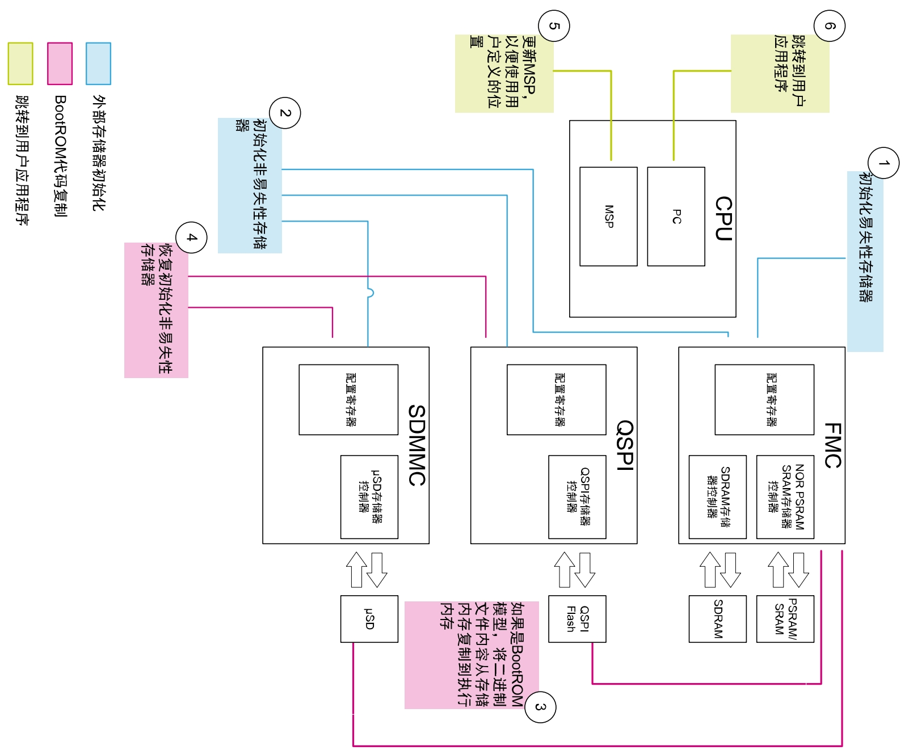

# stm32h750xbh6 bootloader

## XiP

XiP 用例旨在从外部闪存（QSPI 或 FMC-NOR 闪存） “芯片内执行”。用户应用程序代码应链接到目标执行存储器地址（外部 QSPI 或 FMC-NOR 闪存）。

## BootROM

BootROM 用例旨在演示如何从内部闪存启动，配置外部 RAM 存储器（SDRAM 或 SRAM），将用户应用程序二进制文件从代码存储区域（SDCARD 或 SPI-Flash 存储器）复制到外部 SDRAM 或外部 SRAM，然后跳转到用户应用程序。用户应用程序代码应链接到目标执行存储器地址（外部 SDRAM 或 SRAM）。

## ！！！注意事项

1. 外部存储器启动应用程序负责初始化所需资源，以使外部存储器随时可用。该应用程序根据用户配置初始化所需资源。
2. 外部存储器启动应用程序必须设置主堆栈指针，并将应用程序配置为在外部存储器上执行。该类型启动方案支持大小可调的用户应用程序。
3. 外部存储器启动应用程序确保在跳到用户应用程序之前重置或释放安装阶段之后不再需要的任何资源。下图展示了该启动方案：

